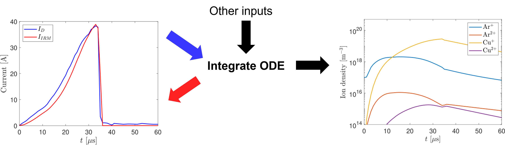
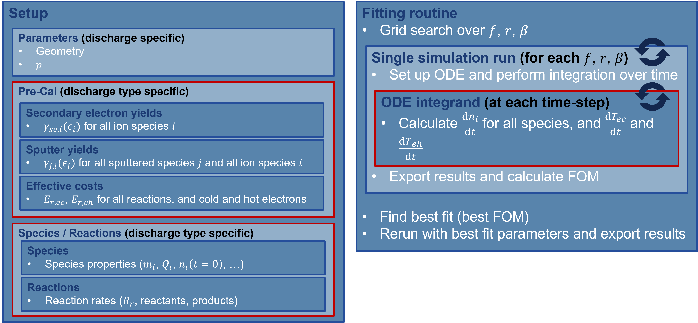
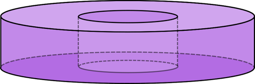

___
# The Ionization Region Model (IRM)
**A brief overview of the model and code details**
___

**Disclaimer:** This is still a work-in-progress and as such not guaranteed to be 100% accurate or correct.

## Table of Contents
[[_TOC_]]
___
## Overview
___

### What is the IRM?

The IRM...
- is a **spatially averaged, time-dependent** model of **HiPIMS** discharges.
    - temporal evolution of e.g. species densities and fluxes
    - no position dependent properties

- is dependent on **experimental input**.
    - no *"completely made up"* discharges - input must be consistent
    - insights into properties that aren't easily accesible experimentally

___
### Working Principle

#### The Ionization Region (IR)
- High plasma density region above race track where most of the ionization events happen
- ~ magnetic trap / bright glow region

**Assumption:** Everything *"interesting"* happens in the IR and at the target

")

#### Basics

- Energy balance in IR
- Particle balance in IR
- Fluxes to and from target
- Fluxes from and to diffusion region

$`\Rightarrow`$ system of ordinary differentail equations (ODEs)

")

As input are needed (a.o.):
- working gas and target material properties
- geometry
- discharge current $`\textcolor{green}{I_\mathrm{D}(t)}`$, voltage $`U_\mathrm{D}(t)`$ and pressure $`p`$
- back-attraction probability $`\textcolor{red}{\beta}`$
- IR potential drop fraction $`\textcolor{red}{f}`$
- electron recapture probability $`\textcolor{red}{r}`$
- ionized flux fraction $`\textcolor{green}{F_\mathrm{flux}}`$



#### Parameter fitting

Use
- back-attraction probability $`\textcolor{red}{\beta}`$
- IR potential drop fraction $`\textcolor{red}{f}`$
- electron recapture probability $`\textcolor{red}{r}`$

as $`\textcolor{red}{\text{fitting paramters}}`$ and

- discharge current $`\textcolor{green}{I_\mathrm{D}(t)}`$
- ionized flux fraction $`\textcolor{green}{F_\mathrm{flux}}`$

as $`\textcolor{green}{\text{model constraints}}`$

")
___

## Model and Implementation Details
___
### Components



___
### Geometrical considerations

- Hollow cylinder ($`r_1, r_2, z_1, z_2`$)
    - $`L=(z_2-z_1)`$
    - $`S_\mathrm{RT}=\pi\,(r_2^2-r_1^2)`$
    - $`V=L\,S_\mathrm{RT}`$
    - $`S_\mathrm{DR}=S_\mathrm{RT}+\pi\,L\,(r_2+r_1)`$

- Volume/Surface averaged quantities
    - Implicitly assumes close to axisymmetric discharges

- B field enters only indirectly through the Current-Voltage waveform, geometry and ionized flux fraction



___
### The system of ODEs

___
#### The ODE

- dependent variables:
    - species densities $`\{n_i\}_{i\in\{\text{species}\}}`$
    - cold electron temperature $`T_\mathrm{ec}`$
- independent variable:
    - time $`t`$
- explicit time dependencies: 
    - current $`I_\mathrm{D}(t)`$ and voltage $`U_\mathrm{D}(t)`$
- particle balance:

    - $`\frac{\mathrm{d}n_i}{\mathrm{d}t}=R_i+\frac{S_\mathrm{RT}}{V}\,\Gamma_{\mathrm{RT},i}-\frac{S_\mathrm{DR}}{V}\,\Gamma_{\mathrm{DR},i}-\nu_{\mathrm{ko},i}\,n_i,\quad \forall i\in\{\text{species}\}\setminus\{\text{electrons}\}`$

    - $`\frac{\mathrm{d}n_\mathrm{ec}}{\mathrm{d}t}=\sum_{i\in\{\mathrm{ions}\}}Q_i\,\frac{\mathrm{d}n_i}{\mathrm{d}t}-\frac{\mathrm{d}n_\mathrm{eh}}{\mathrm{d}t}`$ (forced quasi-neutrality)

- energy balance:

    - $`\frac{\mathrm{d}T_\mathrm{ec}}{\mathrm{d}t}=\frac{P_\mathrm{ec}/V}{\tfrac{3}{2}\,k_\mathrm{B}\,n_\mathrm{ec}}`$

    - $`\frac{\mathrm{d}n_\mathrm{eh}}{\mathrm{d}t}=\frac{P_\mathrm{eh}/V}{\tfrac{3}{2}\,k_\mathrm{B}\,T_\mathrm{eh}}, \quad`$ where $`T_\mathrm{eh}=T_\mathrm{eh}(U_\mathrm{D})`$ is an explicit function of the discharge voltage

___
#### Particle balance (excluding electrons)

```math
\frac{\mathrm{d}n_i}{\mathrm{d}t}=R_i+\frac{S_\mathrm{RT}}{V}\,\Gamma_{\mathrm{RT},i}-\frac{S_\mathrm{DR}}{V}\,\Gamma_{\mathrm{DR},i}-\nu_{\mathrm{ko},i}\,n_i,\quad \forall i\in\{\text{species}\}\setminus\{\text{electrons}\}
```

Production/Loss rate from all volume reactions $`R_i`$:
- target material reactions ( metal <-> electron )
- working gas reactions ( gas <-> electron )
- interaction reactions ( gas <-> metal )

Fluxes from race track $`\Gamma_{\mathrm{RT},i}`$:
- sputtering species (all ions) (negative)
- sputtered species (target material in ground state, scattered (hot) working gas) (positive)

Fluxes to diffusion region $`\Gamma_{\mathrm{DR},i}`$:
- working gas refill (negative)
- directed outwards flux for ions (positive)
- outwards diffusion of all atom species (positive)

Kick-Out frequency $`\nu_{\mathrm{ko},i}`$:
- neutral species (sputter wind)

___
#### Volume reactions

```math
R_i=\sum_{r\in\{\text{reactions producing }i\}}R_r\,N_{r,i}=\sum_{r\in\{\text{reactions producing }i\}}N_{r,i}\,k_r\prod_{j\in\{\text{reactants of reaction }r\}} n_j
```

Products per reaction $`N_{r,i}`$

Rate coefficients $`k_r(T_\mathrm{eff})`$:
- $`k_r(T_\mathrm{eff})=\left(A+B\,T_\mathrm{eff}+C\,T_\mathrm{eff}^D\right)\,\exp(-\tfrac{E}{T_\mathrm{eff}})`$ (generalized Arrhenius), with coefficients $`A, B, C, D, E`$

- target material/working gas
    - impact ionisation
        - from ground state
        - from ionised state
        - from metastable state
    - exitation/deexitation
        - from ground state to meta state
        - from meta state to meta state
        - from meta state to ground state
- interaction
    - charge exchange
    - penning ionisation
___
#### Energy balance

##### Cold electrons

```math
\frac{\mathrm{d}T_\mathrm{ec}}{\mathrm{d}t}=\frac{P_\mathrm{ec}/V}{\tfrac{3}{2}\,k_\mathrm{B}\,n_\mathrm{ec}}
```
```math
P_\mathrm{ec}=P_\mathrm{Ohm,c}+P_\mathrm{de/ex,c}+P_\mathrm{h2c}-P_\mathrm{ion coll. loss}
```

- $`P_\text{Ohm,c}=K_1\,\frac{e\,U_\mathrm{IR}}{e}\,I_\mathrm{D}`$ (IR energization) ($`K_1=0.5`$)
- $`P_\text{de/ex,c}/V=\sum_{r\in\{\text{de/ex,c}\}} E_{\mathrm{ex},r}\,R_r`$ (de-/excitation including Penning)
- $`P_\text{ion coll. loss,c}/V=\sum_{r\in\{\text{coll. loss,c}\}} (E_{r,\mathrm{ec}}+\tfrac{3}{2}\,k_\mathrm{B}\,T_\mathrm{ec})\,R_r`$ (coll. loss to ions)
- $`P_\text{h2c}/V=\sum_{r\in\{\text{coll. hot ion,c}\}} E_\mathrm{h2c}\,R_r`$ (coll. gain from hot ions)

TODO : check and correct

##### Hot electrons

```math
\frac{\mathrm{d}T_\mathrm{eh}}{\mathrm{d}t}=\frac{P_\mathrm{eh}/V}{\tfrac{3}{2}\,k_\mathrm{B}\,T_\mathrm{eh}}
```
```math
k_\mathrm{B}\,T_\mathrm{eh}=\tfrac{3}{2}\,e\,F_\mathrm{Teh}\,U_\mathrm{D}
```
```math
P_\mathrm{eh}=P_\mathrm{Ohm,h}+P_\mathrm{de/ex,h}-P_\mathrm{ionization}
```

- $`P_\text{Ohm,h}=\sum_i\frac{I_{\mathrm{se},i}}{e}\frac{e\,U_\mathrm{sh}}{Q_i}`$ (sheath energization)
- $`P_\text{de/ex,h}/V=\sum_{r\in\{\text{de/ex,h}\}} E_{\mathrm{ex},r}\,R_r`$ (de-/excitation)
- $`P_\text{ionization}/V=\sum_{r\in\{\text{ionization}\}} (E_{r,\mathrm{eh}}+E_\mathrm{h2c})\,R_r`$ (ionization)

TODO : check and correct

___
#### Ion fluxes

##### During the pulse

The average flux of ion species $`i`$ towards the target is given by:
```math
\Gamma_{\mathrm{RT},i}\coloneqq\langle\Gamma_i\rangle_\mathrm{RT}=\cfrac{\int_{S_\mathrm{RT}}\vec{\Gamma}_i\cdot\vec{\mathrm{d}\sigma}}{S_\mathrm{RT}}=\beta_i\,n_i\,v_i
```
where $`v_i=(\frac{Q_i\,e\,U_\mathrm{IR}}{m_i})^{1/2}`$ is the velocity of ion leaving the IR towards the target and the back-attraction probability $`\beta`$ is the fraction of ions returning to the target:
```math
\beta_i=\cfrac{\langle\Gamma_i\rangle_\mathrm{RT}\,S_\mathrm{RT}}{\langle\Gamma_i\rangle_\mathrm{RT}\,S_\mathrm{RT}+\langle\Gamma_i\rangle_\mathrm{DR}\,S_\mathrm{DR}}
```
This leads to the following realtion for the average flux of ion species $`i`$ towards the diffusion region:
```math
\Gamma_{\mathrm{DR},i}\coloneqq\langle\Gamma_i\rangle_\mathrm{DR}=\cfrac{\int_{S_\mathrm{DR}}\vec{\Gamma}_i\cdot\vec{\mathrm{d}\sigma}}{S_\mathrm{DR}}=\cfrac{S_\mathrm{RT}}{S_\mathrm{DR}}\,\left(\frac{\langle\Gamma_i\rangle_\mathrm{RT}}{\beta_i}-\langle\Gamma_i\rangle_\mathrm{RT}\right)=(1-\beta_i)\,\cfrac{S_\mathrm{RT}}{S_\mathrm{DR}}\,n_i\left(\frac{Q_i\,e\,U_\mathrm{IR}}{m_i}\right)^{1/2}
```
In practice $`\beta_i`$ is assumed equal for all ion species.

##### After the pulse (afterglow)

After the pulse, ions are no longer attracted back to the target (i.e. $`\beta=0`$):
```math
\Gamma_{\mathrm{RT},i}=0
```
The ion fluxes towards the diffusion region are given by: 
```math
\Gamma_{\mathrm{DR},i}=\left(1-\beta_i\right)\,\left(1-f_{\mathrm{coll,Ar}}\right)\frac{S_\mathrm{RT}}{S_\mathrm{BP}}\,n_i\,v_{\mathrm{th},i}
```
where $`v_{\mathrm{th},i}=\left(\frac{2\,k_B\,T}{\pi\,m_i}\right)^{1/2}`$ is the thermal (random) velocity

#### Diffusion terms

#### Kickout

___
### SE yield, sputter yield and effective cost of ionization

- Either measured, from theory or extrapolated/fitted
- Secondary electron yield $`\gamma_{\mathrm{se},i}(\epsilon_i),\quad\forall i\in\{\text{ions}\}`$
- Sputter yield $`\gamma_{j,i}(\epsilon_i),\quad\forall j\in\{\text{sputtered}\}\text{ and }\forall i\in\{\text{ions}\}`$
- Effective cost of ionization $`E_{r,\mathrm{ec}},\,E_{r,\mathrm{eh}},\quad\forall r\in\{\text{reacitons}\}`$ ( TODO : verify)

___
### Discharge current reconstruction

```math
I_\mathrm{IRM} = \sum_i I_i + I_{\mathrm{se},i}
```
```math
I_i = e\,Q_i\,S_\mathrm{RT}\,\langle\Gamma_i\rangle_\mathrm{RT}
```
```math
I_{\mathrm{se},i} = (1-r)\,\gamma_i\,\frac{I_i}{Q_i}
```

___
### Ionized flux fraction reconstruction

```math
F_\mathrm{flux} = \left(1+\frac{\xi_n}{\xi_i}\,\frac{\int\langle\Gamma_n\rangle_\mathrm{BP}\mathrm{d}t}{\int\langle\Gamma_i\rangle_\mathrm{BP}\mathrm{d}t}\right)^{-1}
```

___
## Simulation Output / Results
___

- $`\beta`$ (and $`f`$) from fitting procedure
- $`n_i(t)`$ for all considered species
- $`\Gamma_{\mathrm{RT},i}(t)`$ and $`\Gamma_{\mathrm{DR},i}(t)`$ for all non-electron species
    - $`I_{\mathrm{se},i}(t)`$ and $`I_i(t)`$ for all ions
- $`R_r(t)`$ for all considered reactions (volume and sputtering)
- $`T_\mathrm{ec}(t)`$ and $`T_\mathrm{eh}(t)`$
- $`\alpha`$

___
___
___
# Appendix
___

## Symbols

## Explanations

### IR potential drop fraction

### Back-attraction probability

### Rate coefficients

| # | $`K(T_{eff})`$ |
|---|-------------------|
| 1 | $`A\,T_{eff}^B\,\exp(-C/T_{eff})`$ |
| 2 | $`A`$ |
|(3)| $`\exp(A\,\log(T_{eff})^2+b\,log(T_{eff})+C)`$ |
|(4)| $`A\,T_{eff}^B\,\exp(-C/T_{eff})\,(300/500)^D\,\exp(-E/500)`$ |
|(5)| $`\dots`$ |
| 6 | $`A\,T_{eff}^2+B\,T_{eff}+C`$ |
| 7 | $`(T_{eff}^2+B\,T_{eff}+C)/A`$ |
| 8 | $`A-B\,T_{eff}`$ |
| 9 | $`(A+B\,T_{eff}\,)\exp(-C/T_{eff})`$ |

In the latest version, only 1,2,6,7,8,9 are admissible, since they can be reduced to the general form:

```math
K(T_{eff})=(A+B\,T_{eff}+C\,T_{eff}^D)\,\exp(-E/T_{eff})
```

(3) not implemented in latest version, is used for aluminium - reasonable approximation using different form should be possible

(4) not implemented in latest version, unknown use, can be transformed to fit general form

(5) not implemented in latest version, unknown use - very messy

